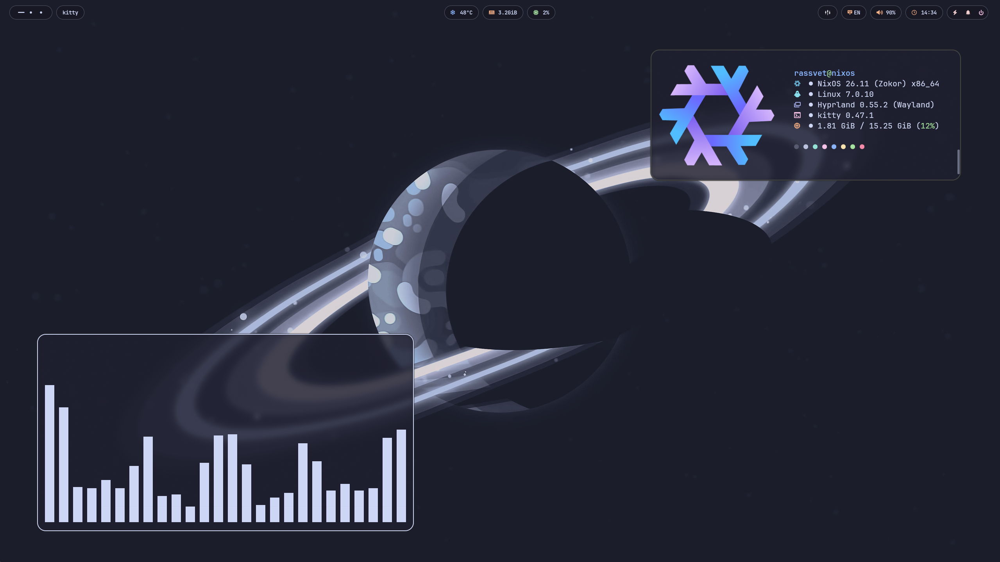

# ❄️ My NixOS & Hyprland Dotfiles

	

  
  
  

---
## ⚙️ System Specification
| Component | Software |
| :--- | :--- |
| **Terminal** | Kitty |
| **Shell** | Fish |
| **Browser** | Zen Browser |
| **Application Launcher** | Rofi |
| **Notification Daemon** | SwayNC |
| **File Manager** | Thunar |

## ⌨️ Keybindings & Shortcuts

> [!NOTE]
> The `SUPER` key is usually the `Windows` key on your keyboard.

### 🚀 Core & Applications
* `SUPER + RETURN` — Kitty
* `SUPER + D` — Rofi 
* `SUPER + E` — Thunar
* `SUPER + W` — Waypaper
* `SUPER + M` — Exit Session
* `Print` — Screenshot

### 🪟 Window Management
* `SUPER + Q` — Close active window
* `SUPER + T` — Toggle floating mode for active window
* `SUPER + F` — Toggle fullscreen mode
* `SUPER + P` — Toggle pseudo-tiled mode
* `SUPER + J` — Toggle split orientation
* `SUPER + Left / Right / Up / Down` — Focus window in specified direction
* `SUPER + Mouse Left Click` — Drag window
* `SUPER + Mouse Right Click` — Resize window

### 🌐 Workspaces & Navigation
* `SUPER + [1-0]` — Switch to workspace 1-10
* `SUPER + SHIFT + [1-0]` — Move active window to workspace 1-10
* `SUPER + Mouse Scroll Down` — Switch to next workspace
* `SUPER + Mouse Scroll Up` — Switch to previous workspace
* `SUPER + S` — Toggle Special Workspace ("Magic" scratchpad)
* `SUPER + SHIFT + S` — Move active window to Special Workspace

## 🚀 Installation

> [!WARNING]
> Do not run this configuration blindly! Do it only when you understand what you are doing! This configuration was created for my devices, so you'll need to modify the section regarding the graphics card drivers in `configuration.nix`, the monitor settings in `hyprland.lua` and some other settings in `flake.nix`
